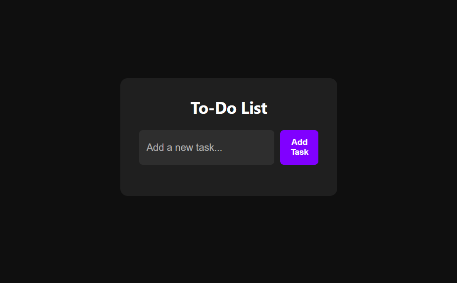
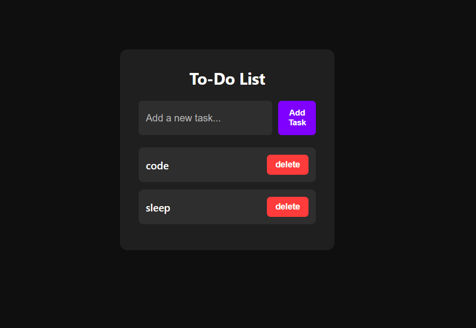
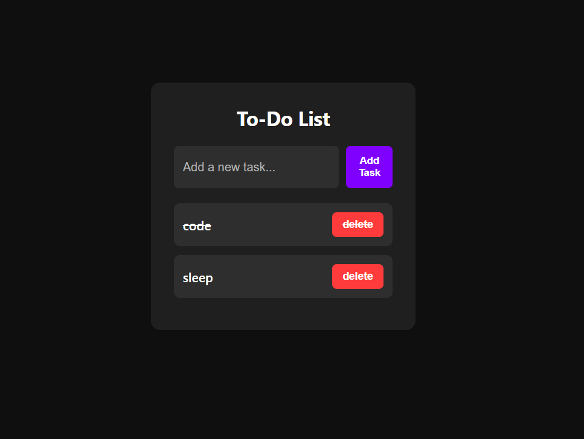
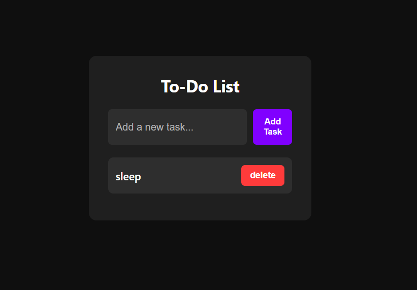

# 📝 Todo List Web App

A simple and responsive Todo List application built using **HTML, CSS, and JavaScript**.
It helps users manage daily tasks by adding, completing, and deleting todos.

---

## 🚀 Live Demo

🔗 https://student-sayan75.github.io/Todo-List/

---

## 🎥 Demo Video

▶️ https://www.youtube.com/watch?v=AJUVWtGnum8

---

## 🛠 Tech Stack

- HTML5
- CSS3
- JavaScript (Vanilla JS)

---

## ✨ Features

- Add new tasks
- Mark tasks as completed
- Delete tasks
- Clean and simple UI
- Responsive design
- Uses localStorage to save tasks (if used)

## 📸 Screenshots






---

## 📂 Project Structure

```
│── index.html
│── style.css
│── script.js
│── screenshots/
│── README.md
```

---

## ▶️ How to Run Locally

1. Clone the repository
   ```bash
   git clone https://github.com/student-Sayan75/Todo-List.git
   ```

```
---

🔮 Future Improvements

- Add due dates
- Task categories
- Dark mode
```
